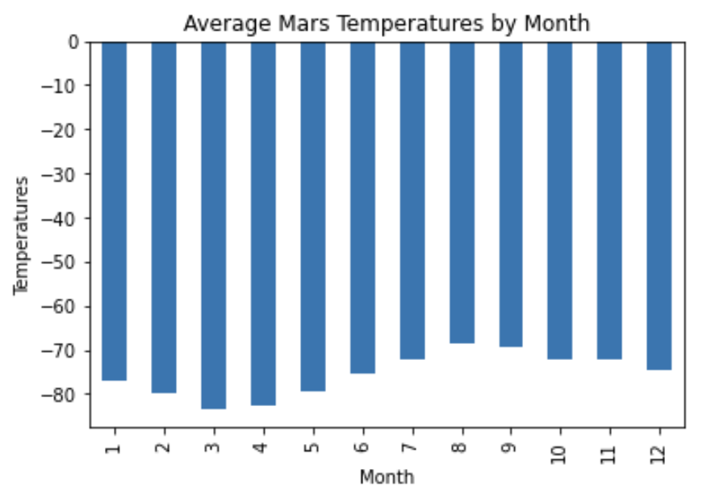
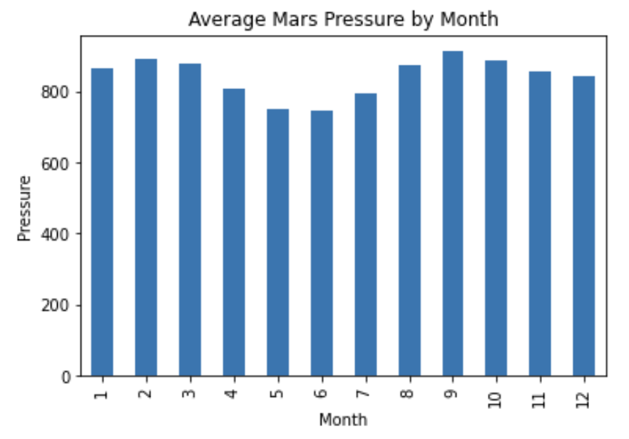
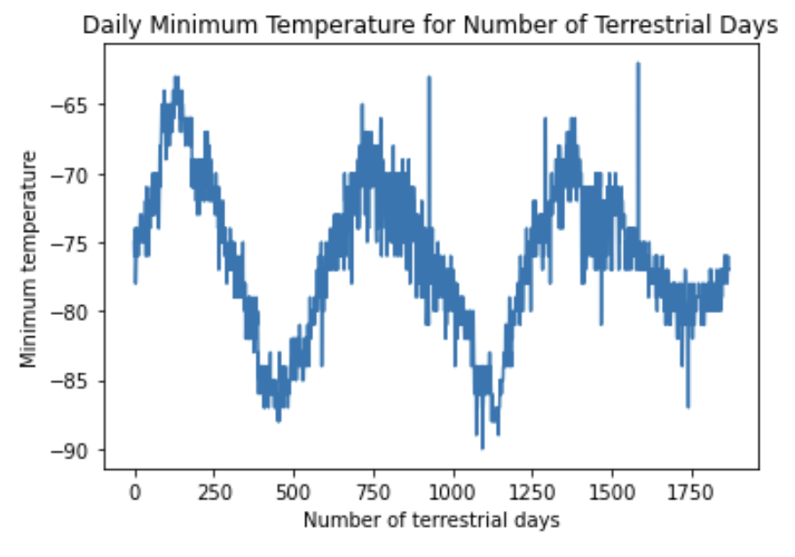

# Mission-to-Mars with Web Scraping

## Overview 
***Background***
We are helping Robin who is a data analyst at SpaceForward. We are helping Robing gather information about the climate of Mars. To do so, we are asked to collect and organize web data into a database using our Web Scraping skills. 

***Purpose***
After learning about identifying HTML elements, learning about Splinter, and HTML parsing using Beautiful Soup, we are asked to scrape, organize, analyze and visualize that data from Mars news articles and Mars weather data from a table. Specifically, we are creating:
- Deliverable 1: Scrape titles and preview text from Mars news articles.
- Deliverable 2: Scrape and analyze Mars weather data, which exists in a table.


## Resources 
- Data Sources: [Mars News Website](https://redplanetscience.com/) and [Mars Temperature Data](https://data-class-mars-challenge.s3.amazonaws.com/Mars/index.html) 
- Software: Python, Pandas, BeautifulSoup, Splinter, Matplotlib, Jupyter Notebook, and DevTools (Chrome)


## Summary and Analysis
For our first task, we scraped the Mars News Website for articles' titles and previews. Once we found the text using Beautiful Soup (an HTML parser) and Chrome's DevTools, we stored the scraping results in a Python list that contained all the dictionaries (title and previews). This is a snippet of what our for loop looked like: 
```
# Create an empty list 
articles_list = []

# Find the title and preview text and create a python dictionary
def get_summary():
    html = browser.html
    soup = BeautifulSoup(html, 'html.parser')
    
    main = soup.find("div", id="news", class_="container")
    articles = main.find_all("div", class_="list_text")
    
    for article in articles:
        title = article.find("div", class_="content_title").text
        preview = article.find("div", class_="article_teaser_body").text
        
        dictionary = {
            "title": title,
            "preview": preview
        }
        articles_list.append(dictionary)
  ```
  
After scraping the articles' titles and previews, we scraped and analyzed Mars Weather Data from a table using a similar process. Once we had our list of data from each row of the table, we then created a Pandas Dataframe from it. After converting to the appropriate data types, we are now able to analyze the Mars Temperature Data to answer the following questions: 

1. How many months exist on Mars?
  - 12 months

2. How many Martian (and not Earth) days worth of data exist in the scraped dataset?
  -  1867 Martian days exist in our dataset 
  
3. What are the coldest and the warmest months on Mars (at the location of Curiosity)? Get the answer by averaging the minimum daily temperature of all the months. Plot the results as a bar chart.

- The coldest month is Month 3 with an average of -83.31 Degrees Farenheit.
- The warmest month is Month 8 with an average of -68.38 Degrees Farenheit.

4. Which months have the lowest and the highest atmospheric pressure on Mars? Get the answer by averaging the daily atmospheric pressure of all the months. Plot the results as a bar chart.

- The lowest atmospheric pressure on Mars is during Month 6 with an average of 745.05 pascals. 
- The highest atmospheric pressure on Mars is during Month 9 with an average of 913.31 pascals.

5. About how many terrestrial (Earth) days exist in a Martian year? That is, in the time that Mars circles the Sun once, how many days elapse on Earth? Visually estimate the result by plotting the daily minimum temperature.

- The distance from peak to peak is roughly 1425 - 750 = 675 days. 
- Therefore, a year on Mars appears to be about 675 days from the plot of daily minimum temperatures on Mars. 

  
   
